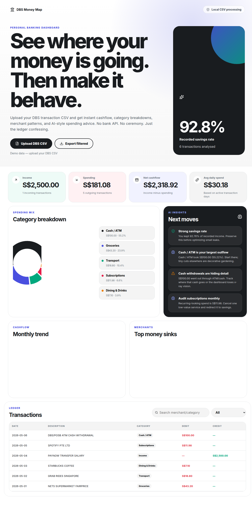

# DBS Banking Dashboard

A small React dashboard for making sense of DBS transaction CSV exports.

I built this because bank statements are technically complete and practically useless. They tell you what happened, but not where the damage is coming from. This app turns a DBS CSV into a spending map: cashflow, categories, top merchants, monthly trends, and a few blunt suggestions on what to fix first.

The app runs entirely in the browser. Your CSV does not get uploaded to a server.



## What it shows

- Income, spending, net cashflow, and savings rate
- Spending by category
- Monthly income vs expense trend
- Top merchants, with noisy DBS transfer references cleaned up
- Searchable transaction ledger
- Local CSV export after filtering
- Rule based spending insights

The insight engine is deliberately simple. It is not pretending to be a financial adviser. It points at obvious patterns: low savings rate, heavy transfers, recurring subscriptions, dining frequency, and categories that are taking too much oxygen.

## Privacy

This is the important bit.

The CSV is parsed in your browser with Papa Parse. There is no backend in the default app, no database, and no analytics call that receives your transactions.

Real bank CSV files should never be committed. The repo ignores CSV files by default:

```gitignore
*.csv
transaction_history*.csv
```

The test data is synthetic.

## DBS CSV support

The parser expects the standard DBS transaction export with columns like:

- Transaction Date
- Value Date
- Statement Code
- Description
- Status
- Currency
- Debit Amount
- Credit Amount

DBS exports often include a few preamble rows before the real header. The parser handles that.

## Categories

The current rules cover common Singapore/DBS descriptions:

- Groceries
- Dining & Drinks
- Transport
- Shopping
- Gaming & Entertainment
- Healthcare
- Subscriptions
- Bills & Utilities
- Cash / ATM
- Transfers
- Fees & Finance
- Other

The merchant cleaner also groups noisy labels such as raw FAST transfer IDs into readable buckets like `Bank Transfer` and `PayLah! Top-up`.

## Run locally

```bash
npm install
npm run dev
```

Open the Vite URL and upload a DBS CSV.

## Test

```bash
npm test
npm run build
```

## Tech stack

- React
- Vite
- Recharts
- Papa Parse
- Vitest

## Project structure

```text
src/finance.js        parser, categorizer, aggregates, insights
src/main.jsx          dashboard UI
src/styles.css        styling
tests/finance.test.js parser and analytics tests
```

## Limits

A few things are intentionally rough because this is still an MVP:

- Transfers need personal tagging. A PayLah top-up may be food, gifts, transport, or "I have no idea anymore."
- Merchant rules are regex based. They work well enough to start, but every bank export has weird little goblins hiding in the descriptions.
- The insights are rule based. Useful, but not magic.

## Roadmap

- Add a category rules editor
- Save custom rules in local storage
- Detect recurring payments
- Split transfers into savings, friends, repayments, and unknown
- Add budget targets by category
- Add a month to month comparison view
- Optional local LLM insights for people who want heavier analysis without sending bank data away

## License

MIT
